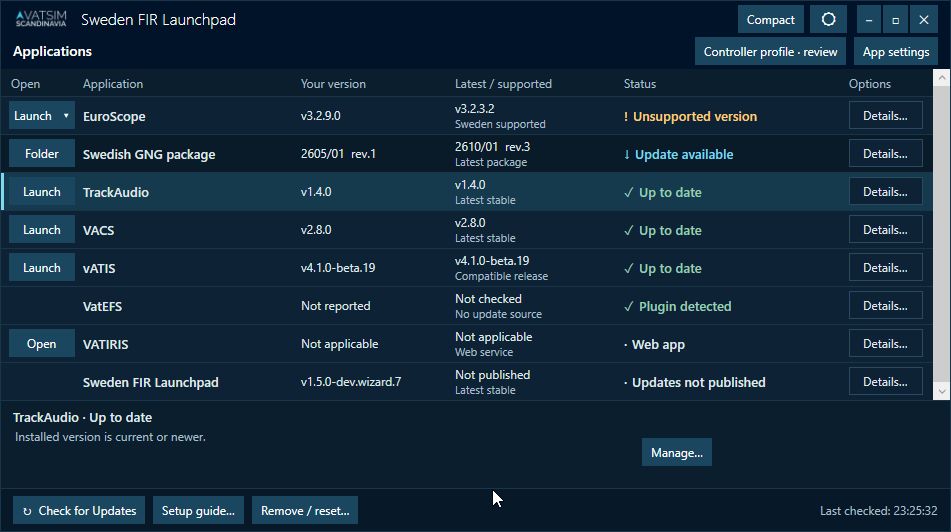

# VATSCA Launchpad

A desktop launchpad for [VATSIM Scandinavia](https://vatsca.org) controllers. It keeps your ATC tools up to date, manages your VATSIM profile across all EuroScope configurations, and lets you launch everything from one place.



---

## Features

- **Update checker** — checks EuroScope, GNG Pack, TrackAudio, VACS, and vATIS against their latest releases
- **Launchpad updates** — installed copies can download an app update and restart to apply it when you choose
- **One-click launch / kill** — start or stop any tool directly from the app
- **EuroScope profile picker** — preselect a `.prf` file so EuroScope opens straight into your sector without the profile dialog
- **Profile sync** — fill in your VATSIM name, CID, password, rating, and Hoppie code once; the app writes them to every EuroScope profile file
- **Dry-run preview** — see exactly which files and lines will change before applying
- **Light / dark theme** — toggle with the ☽ / ☀ button; preference is remembered

---

## Requirements

- Windows 10 / 11
- [.NET 9.0 Desktop Runtime](https://dotnet.microsoft.com/en-us/download/dotnet/9.0) for framework-dependent builds; the installer and portable package include .NET

---

## Installation

Download `SwedenFirLaunchpad-win-x64-Setup.exe` from an installer [release](../../releases). Setup installs for your Windows user, creates a Start Menu shortcut and installs WebView2 if needed. A portable ZIP remains available; older releases contain the standalone `VatscaUpdateChecker.exe`.

The installed app lives under `%LOCALAPPDATA%\SwedenFirLaunchpad`. Settings remain in `%APPDATA%\VatscaUpdateChecker`, and saved credentials keep their existing Windows Credential Manager targets. Data under `%LOCALAPPDATA%\VatscaUpdateChecker`, including any GNG downloads and backups, stays outside the installation directory and is preserved across upgrades and uninstall.

Development packages are self-signed. Their signatures do not establish a publicly trusted publisher or remove Windows SmartScreen warnings. The packaging scripts do not add the certificate to a trusted certificate store.

## Updating Launchpad

The **Sweden FIR Launchpad** row checks this repository's stable Windows update feed. Choose **Download update**, then **Restart to update** when ready. Checks do not download or apply anything, and staged updates are not applied automatically at startup. Finish other operations and close configuration dialogs before restarting.

Standalone and portable copies keep the release-page download flow. Install a Velopack Setup release to opt into managed updates. Until the first installer release is published, no Velopack update feed is available. A failed download can be retried; a verified staged update remains available after reopening Launchpad and checking again. If automatic updating cannot proceed, use the release page to download Setup for the newer version.

---

## First-time setup

1. Open **Settings** (top-right) and set the paths to your installed tools.
2. Open **App Config** and enter your VATSIM details. Click **Preview** to verify, then **Save & Apply**.
3. Click **Check for Updates** (or enable "Check on startup" in Settings).

---

## Building from source

```bash
git clone https://github.com/Sjolus/vatsca-sweden-fir-launchpad.git
cd vatsca-sweden-fir-launchpad
dotnet build vatsca-update-checker.sln
```

**Self-contained single-file publish:**
```bash
dotnet publish VatscaUpdateChecker.csproj -c Release -r win-x64 \
  --self-contained true \
  -p:PublishSingleFile=true \
  -o publish/
```

Requires the [.NET 9 SDK](https://dotnet.microsoft.com/en-us/download/dotnet/9.0) or a compatible newer SDK.

**Self-signed installer and update packages (Windows, PowerShell 7):**
```powershell
./scripts/New-DevelopmentCertificate.ps1
./scripts/Build-Installer.ps1 -Version 1.4.1-dev.1
```

The first command creates or reuses a non-exportable development code-signing key in the current user's Personal certificate store. Only the public certificate and thumbprint are written to `%LOCALAPPDATA%\VatscaUpdateChecker\Signing`; no private key is saved in the repository or included in packages. It does not trust the certificate system-wide or for the current user.

The build script restores the pinned `vpk` tool, publishes the app, signs and packages it, then verifies executable signatures, tamper rejection, package metadata and feed hashes. Artifacts go under `artifacts/installer/<version>/releases`. Use a fresh `-OutputRoot artifacts/<name>` to repeat a build without deleting previous output. Packaging does not run Setup, install the app, or publish a GitHub release. Development signatures are not timestamped; production signing needs a timestamp service and publisher identity.

CI runs the updater regression harness and builds/verifies self-signed installer packages on pull requests as well as main builds. Test artifacts are available from the workflow run. Its temporary signing key remains on the runner and is removed afterward. Version tags prepare a **draft** GitHub release for review. Publish Setup with the full update package and `releases.win-x64.json` to make the release installable and updateable. The app follows stable releases only; `-dev` packages are excluded from its update feed.

**Updater regression checks (synthetic files, no installation or network):**
```powershell
dotnet run --project Tests/LaunchpadUpdate.Tests/LaunchpadUpdate.Tests.csproj -c Release
```

See [the test instructions](Tests/LaunchpadUpdate.Tests/README.md). Actual installation, upgrade/restart and uninstall smoke testing is still required before the first public installer release.

---

## Project structure

```
Assets/           App icon and logo images
Converters/       WPF value converters
Models/           Data classes (AppSettings, CheckResult, ProfileOption)
Services/
  SettingsService.cs         JSON settings persistence (%APPDATA%)
  UpdateChecker.cs           Version checks (EuroScope, GitHub API, HTML scrape)
  ProfileService.cs          EuroScope .prf file patching (Windows-1252 encoding)
  CredentialManagerService.cs  Encrypted credential storage via Windows Credential Manager
Themes/           Light.xaml and Dark.xaml resource dictionaries
```

---

## Credentials & privacy

Passwords and the Hoppie ACARS code are stored in the **Windows Credential Manager** (the same encrypted store used by browsers and Windows itself). They are never written to disk in plain text.

All other settings live in `%APPDATA%\VatscaUpdateChecker\settings.json`.

Update checks and downloads make outbound HTTPS requests to:
- `api.github.com` — latest release info for TrackAudio, VACS, vATIS and Launchpad
- GitHub release asset hosts — Launchpad update feeds and packages
- `files.aero-nav.com` — GNG Pack version check

Setup can also download Microsoft's WebView2 Runtime when it is missing.

---

## Contributing

Pull requests are welcome. Please open an issue first for anything beyond a small bug fix so we can discuss the approach.

See [CLAUDE.md](CLAUDE.md) for architecture notes and non-obvious implementation details.

---

## License

GPL v3 — see [LICENSE](LICENSE).
